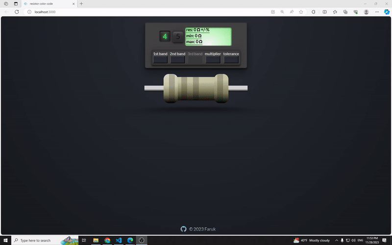

# **resistor color code**

## Deployed live version:
[resistor code](https://resistor-color-code.vercel.app)

## Description

Simple application to get a resistance in Ohm units.
A resistor is an electrical component that limits or regulates the flow of electrical current in an electronic circuit
Ohm's law states that the electric current through a conductor between two points is directly proportional to the voltage across the two points.

## Basic features of this app:

- Switch between 4-band and 5-band resistors.
- Choose a color for each band and get a resistance

## This project uses the following technologies:

- [React](https://reactjs.org) fronted
- [Reducer](https://react.dev/reference/react/useReducer) useReducer hook for state management

## To get a local copy up and running, follow these steps:

1.  Clone the repository using your terminal: `git clone https://github.com/FarukC5/resistor-color-code`

2.  Navigate to vaktija-api folder, and run `npm install` to install NPM packages. Then, run `npm start` to start this app.
